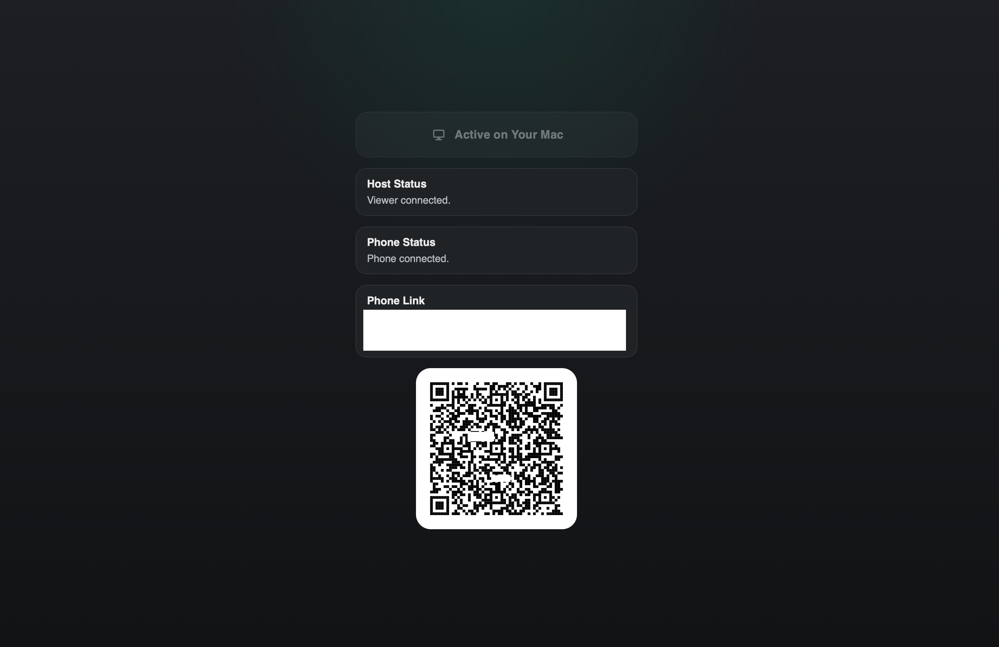
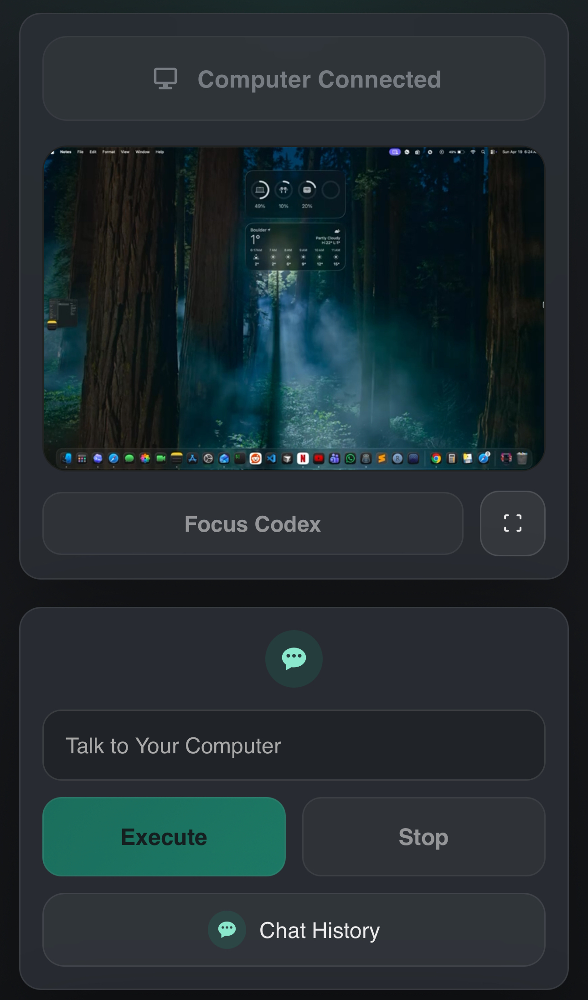
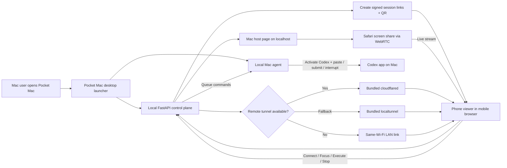

# Pocket Mac

Pocket Mac lets you talk to your computer from your phone and use OpenAI ChatGPT Codex on your Mac from anywhere.

The goal is simple: keep OpenAI ChatGPT Codex running locally on your Mac, stream that experience to your phone, and let your phone act like a lightweight remote control for prompts, focus, stop actions, and your wider computer workflow.

Think of it as computer use from your pocket:

- talk to your computer from your phone
- watch your Mac live while it works
- use OpenAI ChatGPT Codex to build apps and handle real desktop tasks
- keep trust high because you can see what is happening on screen
- stop or redirect the flow at any time
- keep full control instead of handing your machine off blindly

Pocket Mac is not just a prompt relay. It is built around the idea of computer use:

- view your Mac live from your phone
- control the full computer session remotely
- focus Codex instantly without hunting through windows
- send prompts into OpenAI ChatGPT Codex from your phone
- use the same flow for broader desktop tasks around Codex

<table>
  <tr>
    <td align="center"><strong>Mac Host</strong></td>
    <td align="center"><strong>Phone Viewer</strong></td>
  </tr>
  <tr>
    <td align="center"></td>
    <td align="center"></td>
  </tr>
</table>

What it does well today:

- stream your full Mac screen to a phone browser
- open one clean QR code flow from the Mac
- let your phone focus OpenAI ChatGPT Codex and send prompts
- auto-start the local Mac agent for the active session
- create a remote phone link with bundled tunnel tools, with same-Wi-Fi fallback if needed

Why it feels simple:

- one Mac app bundle
- no separate Python install
- no separate Node install
- bundled remote tunnel tooling
- phone uses a browser, not a native app

## Quick Start

### Fastest Way To Try It

1. Download `PocketMac.dmg` from GitHub Releases.
2. Open the DMG and drag `PocketMac.app` into `Applications`.
3. Open `PocketMac.app`.
4. On the Mac page, click `Stream Your Mac Controls to Your Phone`.
5. Allow screen sharing when Safari/macOS asks.
6. Scan the QR code from your phone.

That is the main product flow.

What the app handles for you:

- starts the local web app
- creates the session behind the scenes
- starts the local Mac agent
- tries a bundled remote tunnel first
- falls back to a same-Wi-Fi link if remote providers are unavailable

### What To Expect On First Run

- macOS may warn because the app is not yet signed/notarized
- you may need to right-click `Open` the first time
- macOS will ask for Screen Recording permission
- macOS will ask for Accessibility permission if you want Codex prompt control

### For Testers

You do not need to install:

- Python
- Node
- `cloudflared`
- `localtunnel`

Those are already bundled into the app.

You do need:

- a Mac with the Codex app installed
- internet access for remote mode
- or the same Wi-Fi network for LAN fallback mode

## Status

Implemented and tested:

- self-contained macOS app bundle and DMG
- one-click Mac host flow
- token-protected session links
- phone viewer with native controls
- local Mac agent for Codex focus, prompt paste, and stop
- remote public tunnel flow with bundled provider fallback
- same-network LAN fallback
- smoke tests for session, commands, QR, and WebSocket relay

Not done yet:

- Apple signing and notarization
- production-grade TURN/STUN setup
- full remote mouse and keyboard control
- user accounts and persistent multi-device auth

## Architecture



The prototype is split into three pieces:

1. FastAPI control plane
   - serves the web UI
   - stores session metadata and pending commands
   - issues an unguessable access token per session
   - refuses duplicate session ids so links cannot be re-minted by id alone
   - tracks host, viewer, and agent heartbeats
   - tracks which viewer currently holds the control lease
   - relays WebRTC signaling messages over WebSocket
   - can start a remote trial tunnel and swap viewer links to that public URL

2. Mac host
   - can run either from source or from the packaged Mac app
   - captures the full screen with `getDisplayMedia`
   - displays one QR code and one token-protected phone viewer link
   - shows host and phone connection state in a simplified centered UI
   - keeps using `localhost` for the Mac-side page even when a remote trial tunnel is active
   - streams the media to the phone browser using WebRTC

3. Mac agent
   - runs locally on the Mac
   - polls the FastAPI service for queued commands
   - authenticates using the session token
   - activates the `Codex` app
   - supports native `focus` and `stop` style control actions from the phone viewer
   - replaces the existing draft in the focused Codex prompt field before pasting
   - optionally presses Return to submit
   - can be auto-started by the host page for the active session
   - can be relaunched by the packaged app without requiring Python on the user's machine

## Repo Layout

- `shared-backend/app/main.py`: FastAPI app, session store, command queue, signaling server
- `shared-backend/mac_agent.py`: Mac-side Codex prompt injector
- `shared-backend/pocketcodex_desktop.py`: packaged desktop launcher entrypoint
- `shared-backend/web/host.html`: standalone host page used on the Mac for direct/debug entry
- `shared-backend/web/viewer.html`: mobile viewer/control page
- `shared-backend/web/index.html`: one-click Mac host flow
- `shared-backend/scripts/smoke_test.py`: local API smoke test
- `shared-backend/scripts/fake_tunnel.py`: deterministic test helper for the remote trial flow
- `packaging/build_macos_app.sh`: builds `dist/PocketMac.app` with PyInstaller

## macOS App Packaging

Pocket Mac can now be built as a self-contained macOS app bundle so end users do not need their
own Python installation.

What the packaged app does:

- bundles the Python runtime and Pocket Mac backend
- bundles `cloudflared` for public remote links
- bundles a Node runtime plus `localtunnel` as a second remote fallback
- stores writable app data under `~/Library/Application Support/PocketMac`
- launches the local server itself
- opens the local host UI in the browser
- can relaunch the local Mac agent from the same bundled runtime

Build the `.app` locally:

```bash
./packaging/build_macos_app.sh
```

That produces:

```bash
dist/PocketMac.app
dist/PocketMac.dmg
```

The build script was verified locally by:

- building `dist/PocketMac.app`
- building `dist/PocketMac.dmg`
- launching the bundled executable directly
- hitting `/api/health` successfully from the built app runtime

Current limitation:

- the build supports signing and notarization, but you still need an Apple Developer signing certificate and a notarytool keychain profile on the build Mac

Optional signing and notarization:

```bash
export POCKETMAC_CODESIGN_IDENTITY="Developer ID Application: Your Name (TEAMID)"
export POCKETMAC_NOTARY_KEYCHAIN_PROFILE="pocketmac-notary"
./packaging/build_macos_app.sh
```

If those variables are set, the build script will:

- sign the bundled executable payloads
- sign `PocketMac.app`
- sign `PocketMac.dmg`
- submit the DMG to Apple notarization
- staple the notarization ticket to both the app and DMG

## Development Setup

### 1. Run From Source

```bash
cd shared-backend
python3 -m venv .venv
source .venv/bin/activate
pip install -r requirements.txt
uvicorn app.main:app --reload
```

Optional environment variables for off-network access and more reliable streaming:

```bash
export PUBLIC_BASE_URL="https://your-public-host.example.com"
export ICE_SERVERS_JSON='[{"urls":"stun:stun.l.google.com:19302"},{"urls":["turn:turn.example.com:3478?transport=udp","turns:turn.example.com:5349?transport=tcp"],"username":"user","credential":"pass"}]'
```

Recommended secure deployment shape:

- put Pocket Mac behind HTTPS at `PUBLIC_BASE_URL`
- keep the generated tokenized links private
- configure your own TURN server in `ICE_SERVERS_JSON`
- prefer a dedicated small VPS or Cloudflare/Tailscale-style entry point over exposing a raw home IP

For quick public testing without running your own infra, Pocket Mac now has a temporary remote trial mode:

- it starts a public tunnel to the local FastAPI service
- it keeps the Mac host page on `localhost`
- it switches the adaptive phone viewer link and QR code to the public tunnel URL
- it still shows a separate same-Wi-Fi viewer link and QR code

The current implementation tries tunnel providers in this order:

- bundled `cloudflared`
- bundled `localtunnel`
- same-Wi-Fi LAN fallback when both remote providers are unavailable

### 2. Start the Mac agent manually

```bash
cd shared-backend
source .venv/bin/activate
python3 mac_agent.py --session demo123 --token YOUR_SESSION_TOKEN
```

For a dry run that does not type into the Codex app:

```bash
python3 mac_agent.py --session demo123 --token YOUR_SESSION_TOKEN --dry-run
```

The streamlined launch/host flow can now start the local Mac agent automatically for the active session.
The manual command above is still useful as a fallback and for debugging.

### 3. Open Pocket Mac on the Mac

Open:

- `http://127.0.0.1:8000/`

The launch page now owns the Mac host flow directly:

- one start button on the Mac
- session creation happens behind the scenes
- the same click starts local session setup, tunnel selection, agent startup, and the Safari screen-share request
- the same page then shows the single phone link, single QR code, and phone connection status
- once active, the button changes state instead of suggesting another manual share step

The Mac-side UI intentionally exposes only one path:

- `Stream Your Mac Controls to Your Phone`
- one phone viewer link
- one QR code
- one phone connection status indicator
- the same first click also starts the local Mac agent for that session

Under the hood, the host flow now requests entire-screen sharing only. Safari still controls the
final picker, so you will be asked to choose the full screen when sharing begins.

If you need a direct/debug entry, `host.html` still exists, but the normal product flow should start from `/`.

### 4. Open the viewer page on the phone

Use the generated viewer link from the launch page.

If you are testing outside your local network, put the server behind a secure tunnel or relay.

The viewer is now a hybrid remote console:

- the live stream stays front and center
- only one viewer at a time can `Take Control`
- native buttons on the phone can `Send`, `Paste Draft`, `Focus`, and `Stop`
- additional viewers can still watch, but they stay read-only until they take control

### 5. Remote Trial

The one-click Mac flow now starts the remote phone path automatically during preparation.

That does three things:

- starts a temporary public tunnel to the local Pocket Mac server when available
- updates the phone viewer link and QR code to the public tunnel URL
- falls back to a same-Wi-Fi link when public tunnel providers are unavailable

Important limitations:

- the trial lasts only while the tunnel process is alive
- the public tunnel URL is internet-reachable, so the session token in the generated link is still sensitive
- this is meant for testing and demos, not production-grade uptime

## Local Testing

Run the smoke test:

```bash
cd shared-backend
source .venv/bin/activate
python3 scripts/smoke_test.py
```

This validates:

- health endpoint
- session creation
- duplicate session rejection
- heartbeat updates
- command enqueue
- command claim
- command completion
- single-controller lease behavior for viewer-issued commands
- token-protected access control
- WebSocket viewer/host message relay
- QR SVG generation
- remote trial start and stop behavior using a fake tunnel helper
- static pages

## macOS Permissions

The streaming host page needs browser permission to share the screen or window.

The Mac agent needs macOS Accessibility permission to send keystrokes to the Codex app.

At the current prototype stage, the browser-level flow works until Safari reaches the native
screen/window selection step. That chooser is expected to require human interaction during real
stream testing.

## Current Feature Notes

- The phone viewer is now stream-first, with a native bottom control surface instead of only a raw prompt form.
- Only the active controller can queue commands; other connected viewers remain read-only until they take control.
- The phone viewer currently sends structured Codex actions rather than arbitrary raw mouse or keyboard events.
- The stream is browser-based, so it does not yet require a packaged macOS app.
- The Mac agent targets an app named `Codex` by default.
- Safari screen sharing works when the Mac page is opened on `localhost` or HTTPS.
- The launch page now doubles as the host flow, so the first click handles session setup, tunnel selection, agent startup, and the browser screen-share prompt in one place.
- The standalone host page is still present for debugging, but the main UI path is `/`.
- Prompt injection now replaces the existing Codex draft by default, which avoids accidental prompt concatenation during phone control.
- The viewer page now shows recent command results, controller status, and whether the host and agent appear online.
- Set `PUBLIC_BASE_URL` to a public HTTPS URL if you want QR codes that open correctly off-network.
- The current host flow prefers a public remote-trial phone link and only falls back internally when a tunnel provider is unavailable.
- If every public tunnel provider fails, the Mac page shows a same-network-only phone link instead of a broken remote link.
- For reliable cross-network streaming, configure a TURN server in `ICE_SERVERS_JSON`.
- Reusing a session now means reopening its original signed host/viewer link, not recreating the session by id.

## Near-Term Roadmap

- move from polling to a persistent control socket for the Mac agent
- add basic remote click targets for common Codex actions
- add a small Swift menu-bar app so the Mac side is one install instead of a browser page plus script
- bundle a hosted relay path so the public URL and TURN config work without manual env setup
